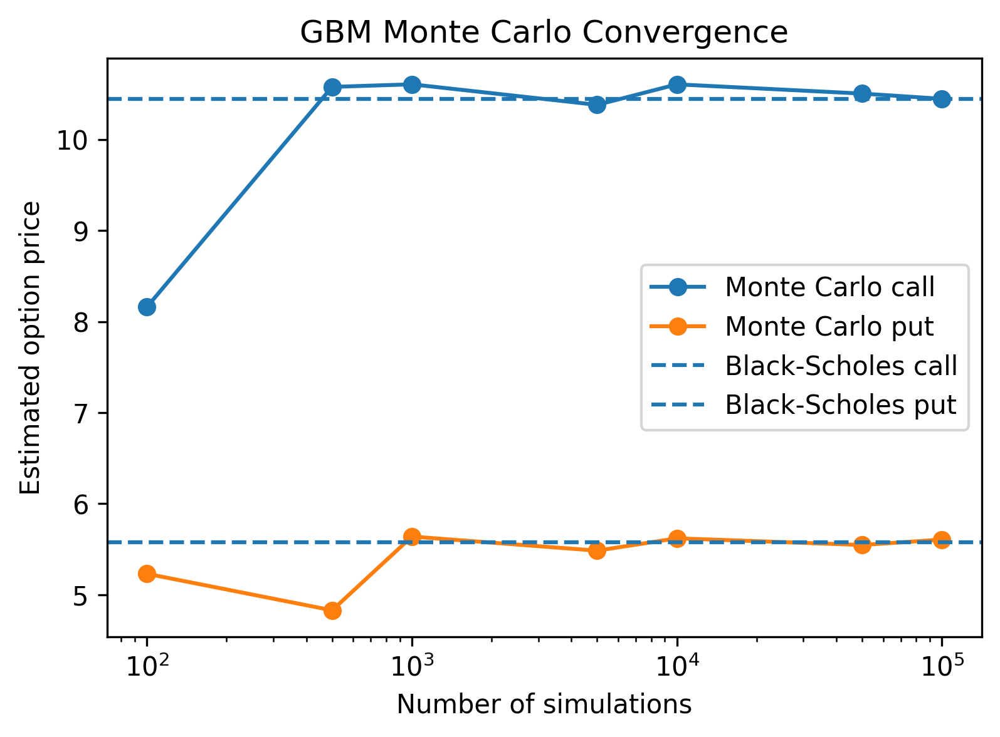
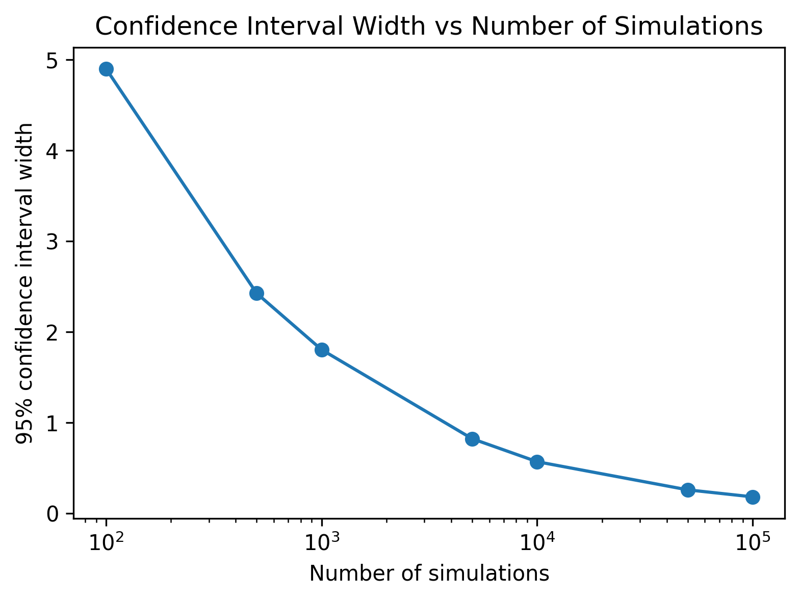

# Monte Carlo Option Pricing

This project prices European call and put options using Monte Carlo simulation under geometric Brownian motion.

It also compares the Monte Carlo estimates with the Black-Scholes benchmark and shows how simulation accuracy improves as the number of simulations increases.

## Files

* `monte_carlo_option_pricing.py`
  Contains a reusable Monte Carlo option pricing function.

* `black_scholes.py`
  Contains a Black-Scholes benchmark pricing function.

* `convergence_analysis.py`
  Generates convergence and confidence interval plots.

* `requirements.txt`
  Lists the required Python packages.

## Model

The terminal stock price is simulated using geometric Brownian motion:

```python
S_T = S0 * exp((r - 0.5 * sigma**2) * T + sigma * sqrt(T) * Z)
```

where:

* `S0` is the initial stock price
* `K` is the strike price
* `r` is the risk-free rate
* `sigma` is the volatility
* `T` is the time to maturity
* `Z` is a standard normal random variable

The option payoff is then averaged across many simulations and discounted back to today.

## Example Parameters

```python
S0 = 100
K = 100
r = 0.05
sigma = 0.2
T = 1
N = 100000
```

For these parameters, the Black-Scholes benchmark is approximately:

| Option | Black-Scholes Price |
| ------ | ------------------: |
| Call   |               10.45 |
| Put    |                5.57 |

The Monte Carlo estimate should get close to these values when the number of simulations is large.

## Example Plots

### Monte Carlo Convergence

This plot shows that Monte Carlo estimates are noisy for small simulation counts, but become more stable as the number of simulations increases.



### Confidence Interval Width

This plot shows that the confidence interval width shrinks as the number of simulations increases.



## How to Run

Install the requirements:

```bash
pip install -r requirements.txt
```

Run the main pricing file:

```bash
python monte_carlo_option_pricing.py
```

Run the convergence analysis:

```bash
python convergence_analysis.py
```

## Key Ideas

This project demonstrates:

* Monte Carlo simulation
* geometric Brownian motion
* European call and put option payoffs
* discounting expected payoffs
* comparison with Black-Scholes prices
* convergence as simulation count increases
* confidence interval width shrinking like `1 / sqrt(N)`
